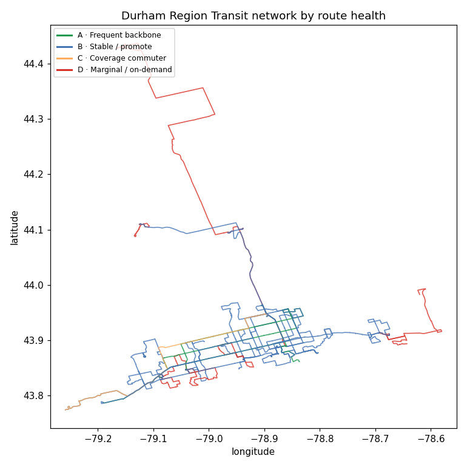
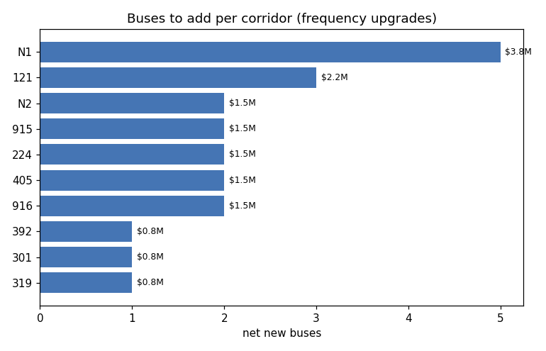
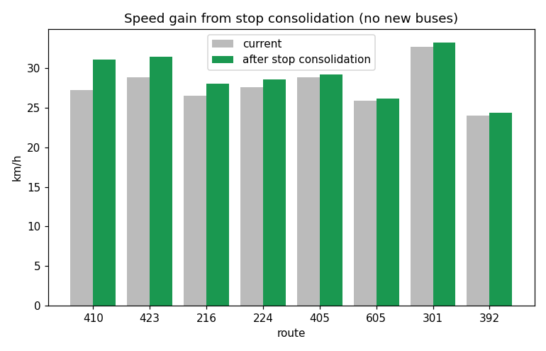
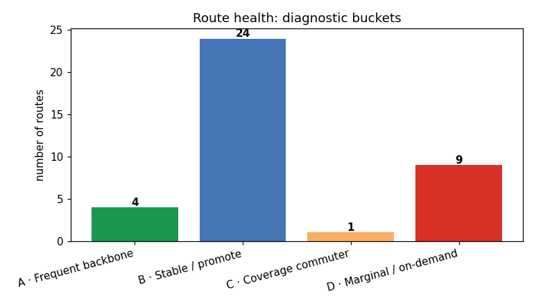

# 🚌 Durham Region Transit — Network Optimization Toolkit

[](https://github.com/romin4444/drt-network-optimization/actions/workflows/ci.yml)
[](LICENSE)
[](https://colab.research.google.com/github/romin4444/drt-network-optimization/blob/main/drt_pipeline.ipynb)

> **In one sentence:** this project studies every bus route in Durham Region
> (Ontario) using the transit agency's own public data, then recommends how to
> make the network faster, more frequent, and fairer — and tells you **what it
> would cost**.

It answers questions a transit planner (or a curious taxpayer) actually asks:
*Which routes are great and which are struggling? Where should we add buses, and
how much would that cost? Which slow routes could be sped up for free? And which
low-ridership routes are someone's only ride and must NOT be cut?*

---

## 🎯 The headline finding

Using the live Durham GTFS feed (**38 weekday routes, ~2,455 daily trips**), the
toolkit produces a costed, equity-checked plan:

| Recommendation | Result |
|---|---|
| 🟢 Speed up slow routes by removing over-close stops | up to **+7 min/round-trip**, no new buses |
| 🔵 Upgrade key corridors to 15-min frequency (peak-headway sized) | **+19 buses**, ~**$14.3 M** capital, **+$10.9 M/yr** to operate |
| 🔴 Convert truly marginal routes to on-demand | frees **4 buses** net (microtransit still uses vehicles) |
| 🛡️ **Protect lifeline routes from cuts** | **5 routes** kept (sole service for their riders) |

> Better service *costs money* — the operating figure is a cost, not a saving. The
> earlier version reported a phantom "$3 M/yr saving" because on-demand was modelled
> as free and the fleet was sized on median (not peak) headway. Both are now fixed.

➡️ **The full plain-English plan is in [`drt/map_data/DRT_PLAN.md`](drt/map_data/DRT_PLAN.md).**

---

## 🗺️ See it

**[▶ Open the interactive map (`map.html`)](map.html)** — every route, coloured by
health, click for details. (Download the file and open it in any browser.)

| The network, by route health | Where to add buses | Free speed-ups |
|---|---|---|
|  |  |  |



---

## 🧒 Explain it like I'm five

Buses run on timetables. This project downloads Durham's real timetable (and
live GPS data), measures how each route behaves, and sorts every route into four
groups:

- **🟢 A — Frequent backbone:** the busy, reliable routes. *Protect & invest.*
- **🔵 B — Stable / promote:** solid routes; some could run more often.
- **🟠 C — Coverage commuter:** mostly rush-hour, irregular. *Restructure.*
- **🔴 D — Marginal:** very few trips. *Maybe replace with on-demand vans —*
  *unless they're the only service in the area (then we keep them).*

Then it works out the buses and dollars needed to improve things, and double-
checks that no money-saving idea accidentally strands people who depend on the
bus.

---

## 📖 Glossary (no jargon left behind)

| Term | Plain meaning |
|---|---|
| **GTFS** | The standard public file format transit agencies publish their schedules in. |
| **GTFS-RT** | The *real-time* version — live bus GPS and delays. |
| **Headway** | Minutes between buses on a route. "15-min headway" = a bus every 15 min. |
| **OTP / on-time** | On-Time Performance — did the bus arrive close to schedule (−1 to +5 min)? |
| **CoV** | How *irregular* the gaps between buses are. High = bunched/unreliable. |
| **PVR** | Peak Vehicle Requirement — how many buses a route needs at once, incl. rest time. |
| **Lifeline route** | A route that is the *only* service within a 400 m walk for most of its stops. |
| **Bucket A/B/C/D** | The four health grades above. |

---

## 🏃 Run it yourself

**Non-coders:** click the **Open in Colab** badge above — it runs in your browser,
no install.

**Locally:**
```bash
pip install -r requirements.txt
python run_all.py        # full pipeline  -> drt/map_data/DRT_PLAN.md
python make_visuals.py   # charts + map.html
pytest -q                # test suite (also runs as `python test_drt.py`)
```

The notebook lives in [`notebooks/`](notebooks/); all production logic is in the
root `.py` modules.

---

## 🛠️ How it works (for engineers)

```
                       ┌───────────────── PLANNING PATH (schedule-only) ─────────────────┐
GTFS static feed ──► gtfs_quality.py ──► route_design.py ──► equity.py ──► route_optimizer.py ──► generate_report.py
(drt/gtfs/)          (quality GATE,        (A/B/C/D            (lifeline      (peak PVR + $ cost      (DRT_PLAN.md)
                      aborts on error)      scorecard)          coverage)      + equity guard)        + make_visuals.py

                       ┌──────────── ML PATH (real-time, SEPARATE) ────────────┐
GTFS-RT feed ──► drt_pipeline.py --logger ──► --features DATE ──► --train (LightGBM OTP, see MODEL_CARD.md)
(live)           (long-running collector)      (join RT↔schedule)   └─► drt/otp_model.txt
```

**Honest scope note:** the two paths are *deliberately separate*. The OTP model is
a **real-time nowcaster** — its strongest feature is the *previous stop's actual
delay*, so it can only predict once a bus is running. The schedule-based planning
path therefore does **not** consume the model (and couldn't, for a route that
doesn't exist yet). The model is a diagnostic/analysis artifact, not an input to
the costed plan. (An earlier diagram implied an integration that doesn't exist.)

`drt_config.py` is the **single source of truth** — service standards, cost/fleet
assumptions, and *all* shared helpers (`haversine`, `t_to_sec`, `route_family`,
`current_weekday_services`). Every module imports them; there are no longer
duplicate copies that can drift. There is also exactly **one** scorecard
computation (`route_design.route_scorecard`); `baseline_report.csv` is a thin
copy of `route_scorecard.csv`, not a second, disagreeing calculation.

### Production data collection (roadmap)
`--logger` is a standalone long-running process (run it under `systemd`/`cron` on
a Pi/VPS, **not** inside the batch run). It now writes one small Parquet shard per
poll (O(1) I/O — the old version rewrote the whole day every 20 s), and
`consolidate_rt_log()` compacts a day's shards afterward. For a true multi-week
deployment the next step is to swap the shard directory for a time-series store
(TimescaleDB / Parquet-on-S3) that the feature builder queries.

### What makes it more than a notebook
| Concern | How it's handled |
|---|---|
| **Schedule versions** | Only services *active on the target date* are counted (date-bounded, so a pre-loaded future schedule isn't picked). |
| **Fleet sizing** | Peak Vehicle Requirement sized on the **peak** headway, incl. recovery time + spare ratio. |
| **Budgeting** | Every recommendation is costed — including on-demand (microtransit isn't free); operating cost is based on revenue-hours, not vehicles × full day. |
| **Equity** | On-demand conversion is blocked for lifeline routes (one `LIFELINE_THRESHOLD` constant, used everywhere). |
| **Data trust** | A validator gates the pipeline; dirty feeds fail loudly. |
| **Model integrity** | Train/val/test split (early-stop on val), grouped/temporal by trip, with baselines — see [`MODEL_CARD.md`](MODEL_CARD.md). |
| **No drift** | One config, one scorecard, one calendar selector — imported, never copy-pasted. |
| **Regression safety** | `pytest` suite (cost math, buckets, thresholds, calendar) + GitHub Actions CI. |

## 🤖 The model

A LightGBM classifier predicts whether an arrival will be on time. Read
[`MODEL_CARD.md`](MODEL_CARD.md) first — it is **honest about the current
limitation that only one day of real-time data has been collected**, so the
model is a validated *scaffold*, not yet a trustworthy predictor. It is a
real-time nowcaster and is **not consumed by the planning path** (see the scope
note above). Several weeks of logging are needed before its metrics mean anything.

## 📂 Key outputs (`drt/map_data/`)
- `DRT_PLAN.md` — the decision-ready brief
- `route_scorecard.csv` — per-route diagnostics + bucket
- `route_equity.csv` — coverage criticality / accessibility
- `route_optimization_scorecard.csv` — costed fleet plan
- `route_bundle.json` — data behind the interactive map

## 📄 License
MIT (code) — see [LICENSE](LICENSE). Transit data © Durham Region Open Data.
